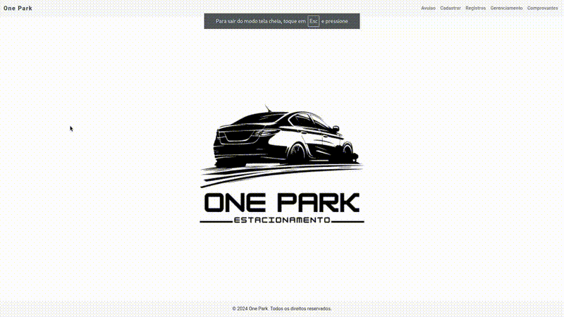

Esta é uma aplicação web voltada para a gestão de estacionamentos, permitindo o controle de clientes avulsos e o cadastro de mensalistas, além de realizar o controle de faturamento com um caixa diário e gerar comprovantes de serviço, com base no número de comprovante gerado. Atualmente, estamos trabalhando na página de clientes avulsos, onde há um controle para evitar a duplicação de números de comprovantes. Para cada novo cliente inserido, um número único é gerado automaticamente. Ao começar a digitar o nome do cliente, a data e o horário atuais são automaticamente preenchidos nos campos correspondentes. Além disso, o sistema sugere dois serviços padrão: "Lavagem com cera" e "Lavagem simples".

